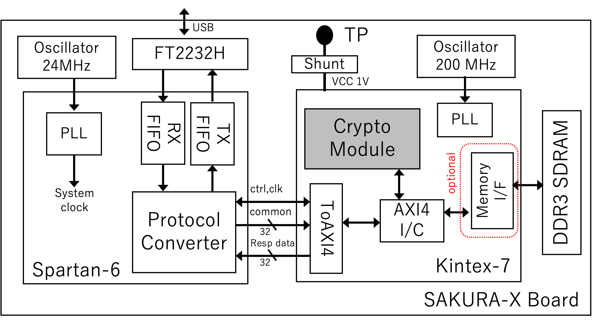

# SAKURA-X-SHELL

This repository provides a shell template for SAKURA-X board.
Vivado 2023.2 was used to verify the design.

## Overview

SAKURA-X is composed of two FPGAs, Spartan-6 and Kintex-7.
Once the Spartan-6 FPGA is configured with the provided design,
you don't need to reconfigure it.
The Spartan-6 FPGA is responsible for bridging the Kinex-7 FPGA and the host PC.

The Kintex-7 FPGA is designed to implement your cryptographic module.
The shell template provides an AXI4 interface to connect your IP.
So, you can easily implement your IP, which has an AXI4 interface, and communicate with the host PC via USB.
Thanks to the AXI4 interface, a multi-clock design is also available.
The template optionally includes a Memory Interface Generator (MIG) IP to use DDR memory.



## Project for Spartan-6
[sakura-x-shell-ctrl](./sakura-x-shell-ctrl) includes ISE project for Spartan-6 FPGA.
In addition, pre-built bitstream file and MCS file are included in that directory.
The pre-built design is clocked at 50 MHz.
Please see [Configuration with iMPACT](./doc/config_with_impact.md) to configure the Spartan-6 FPGA.

## Create a template project for Kintex-7

First, clone this repository.
```bash
git clone https://github.com/hal-lab-u-tokyo/sakura-x-shell.git
cd sakura-x-shell
```

The following command will launch Vivado and create a project
```bash
vivado -source vivado/init-shell-project.tcl
```
For more details, see [doc/create_project.md](doc/create_project.md).

## Communication with SAKURA-X

We also provide driver software to communicate with SAKURA-X via USB.
It is included in our [ChipWhisperer Plugin](https://github.com/hal-lab-u-tokyo/chipwhisperer-enhanced-plugins).
Thus, it is compatible with [ChipWhisperer](https://github.com/newaetech/chipwhisperer), which is a popular open-source tool for side-channel analysis.

To communicate with your cryptographic module on SAKURA-X,
you have only to implement a Python class derived from a base class provided in the plugin.
The base class already implements common functions to communicate with SAKURA-X controller part.
For more details, see [here](https://github.com/hal-lab-u-tokyo/chipwhisperer-enhanced-plugins/blob/master/docs/hardware.md)

## Design examples
### RTL implementation of AES 128-bit encryption
[ip_repo](./vivado/ip_repo) contains an IP core wrapping sasebo-giii AES core developed by AIST.

After creating a project with the template, as described above, you can create a block design by running the following command in the Vivado Tcl console.
```tcl
source <path to this repo>/examples/aes128_rtl/create_bd.tcl
```

Memory-mapped registers are as follows:

|      Address      |     Width   |   Description     |
|:-----------------:|:-----------:|:-----------------:|
| `BASE` + `0x00`   |   128 bit   |  Key (R/W)        |
| `BASE` + `0x10`   |   128 bit   |  Plaintext (R/W)  |
| `BASE` + `0x20`   |   128 bit   |  Ciphertext (R)   |
| `BASE` + `0x30`   |   32 bit    |      Control      |

`BASE` is 0x8000_0000 in the example design.

If `control[1]` bit is set to 1, the key is written to the IP core.
If `control[0]` bit is set to 1, the plain text is written to the IP core and the encryption process is started.


### HLS implementation of AES 128-bit encryption

Corresponding HLS code is also available in [examples/aes128_hls/hls](./examples/aes128_hls/hls).

To create an IP core from the HLS code, go to the directory and run the following command:
```bash
vitis_hls -f create_ip.tcl
```
Then, the HLS project will be created in the `hls_sakura_aes_enc`.
The generated IP core depends on the target frequency.
The above tcl script sets the target frequency to 50MHz.

As shown in the following figure, the IP core has an AXI4-Lite slave port to control the encryption process and an AXI4 master port to read/write data including key, plaintext, and ciphertext.


To create a block design with the HLS IP core, run the following command in the Vivado Tcl console.
```tcl
source <path to this repo>/examples/aes128_hls/create_bd.tcl
```

The HLS IP core has AXI4 Lite slave interface to control the encryption process and set memory addresses of key, plaintext, and ciphertext.
See [AMD UG1399](https://docs.amd.com/r/2023.2-English/ug1399-vitis-hls) for more details about the control and status registers.

The base address of s_axi_control is 0x8000_0000 in the example design.
- 0x00 : Control signals
    -   bit 0  - ap_start (Read/Write/COH)
    -   bit 1  - ap_done (Read)
    -   bit 2  - ap_idle (Read)
    -   bit 3  - ap_ready (Read/COR)
    -   bit 4  - ap_continue (Read/Write/SC)
    -   bit 7  - auto_restart (Read/Write)
    -   bit 9  - interrupt (Read)
    -   others - reserved
- 0x10 : address of key
- 0x18 : address of plaintext
- 0x20 : address of ciphertext

(SC = Self Clear, COR = Clear on Read, TOW = Toggle on Write, COH = Clear on Handshake)

### VexRiscv on SAKURA-X
To be added.

## License

This repository is licensed under MIT License, see [LICENSE](LICENSE) for more information.
