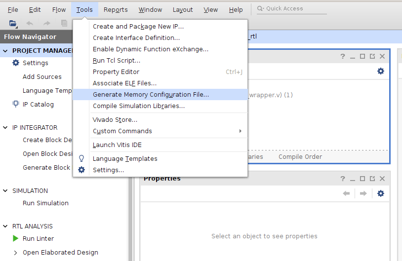
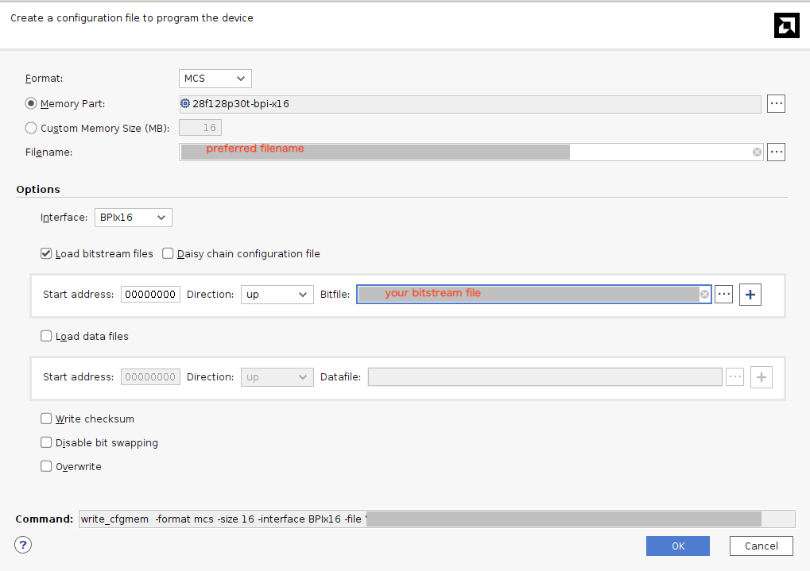
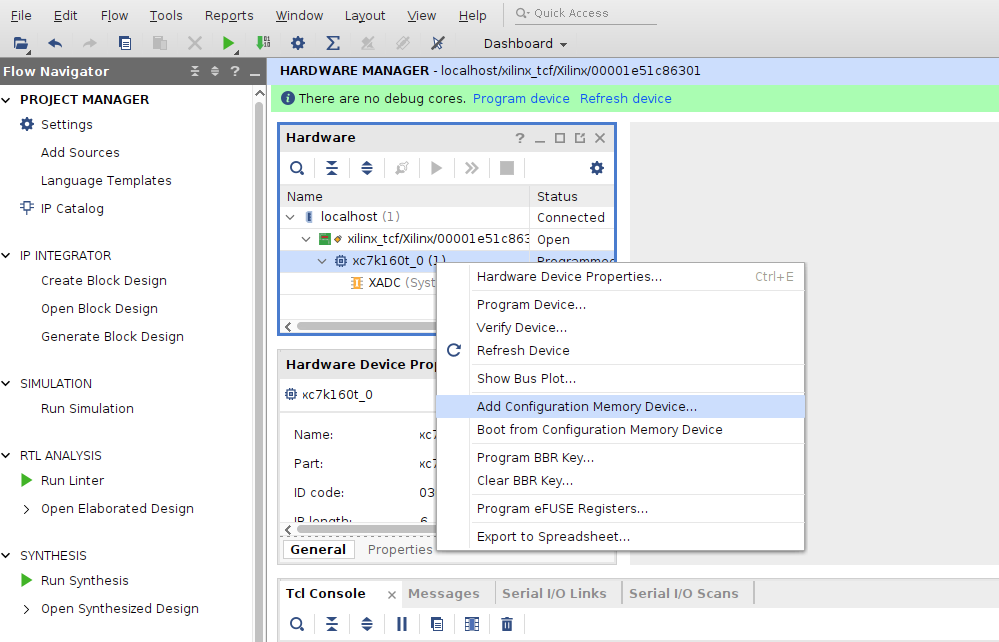
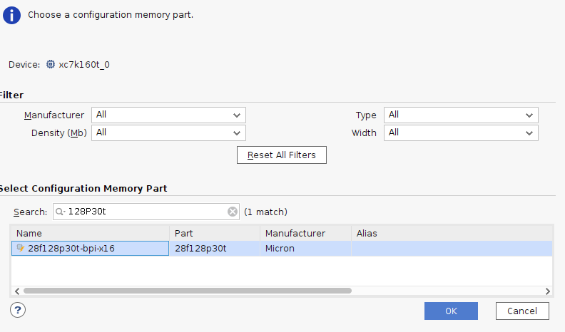
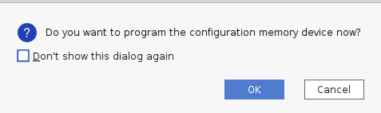
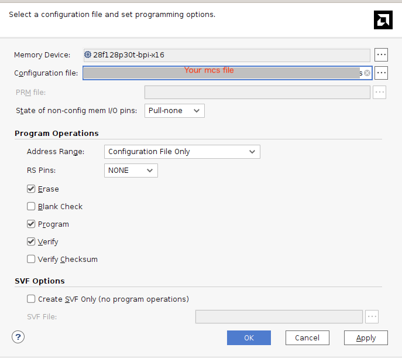

SAKURA-X board has 28f128p30t-bpi-x16 flash memory for Kintex-7.
The flash memory can be used to store the bitstream file and configure the FPGA at boot time.
Using hardware manager in Vivado, the bitstream file can be programmed into the flash memory.

If you use ISE and Impact instead of Vivado, please refer to [this document](./config_spartan6.md).

## Create MCS file
This section describes how to create an MCS file from a bitstream file using Vivado.
If you have already created an MCS file or use pre-built example files, you can skip this section.

1. Open Vivado project

2. Select "Generate Memory Configuration File" from the "Tools" menu

3. Select "MCS" as format type and "28f128p30t-bpi-x16" as Memory Part.
Then, set your preferred output filename.

4. Select "BPIx16" as interface type and check "Load bitstream files".

5. Select your bitstream file at the first row and set the address to 0x00000000 and direction to "up".

6. Click "OK" to generate the MCS file.

## Program Flash Memory

1. Open Hardware Manager

2. Connect to the FPGA board using JTAG

3. Right-click on the FPGA device "xc7k160t" and select "Add Configuration Memory Device"

4. Select "28f128p30t-bpi-x16" as the memory part and click "OK"

If the dialog as below appears, click "OK".

5. Select the generated MCS file and click "OK". "Erase", "Program", and "Verify" should be checked.
After that, if no error occurs, the flash memory successfully programmed.

