# Configuration with iMPACT

## Use Xilinx Platform Cable USB II with ISE

### Issues
The following driver installation script no longer works with the recent Linux kernel.
```
<Path to ISE>/ISE_DS/common/bin/lin64/install_script/install_drivers
```

### Alternative solution

Unofficial driver is provided at the following link: https://rmdir.de/~michael/xilinx/


1. Install prerequisites
For Ubuntu,
```
sudo apt install libusb-dev fxload
```

For CentOS/Rocky Linux,
```
dnf config-manager --set-enabled crb
dnf install libusb-devel fxload
```


2. build & install the driver
```
mkdir /opt/xilinx-usb-driver && cd /opt/xilinx-usb-driver
sudo git clone git://git.zerfleddert.de/usb-driver
cd usb-driver
sudo make
sudo ./setup_pcusb <Path to 14.x/ISE_DS/ISE>
sudo udevadm control --reload-rules
```

### Run Impact with the installed driver
```
LD_PRELOAD=/opt/xilinx-usb-driver/usb-driver/libusb-driver.so imapct
```

1. Connect the Platform Cable USB II to the PC and the Spartan-6 

1. File -> New Project

2. The following dialog will appear. Click Yes.

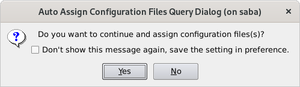

3. Choose "Configure devices using Boundary-Scan (JTAG)" and click OK

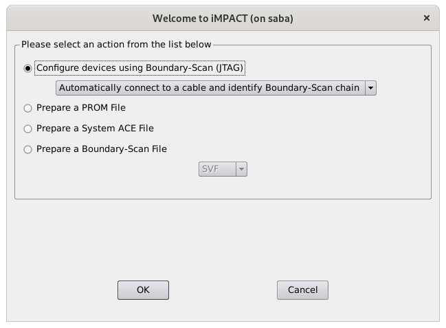

4. If the driver is installed correctly, the connected FPGA device will be detected.

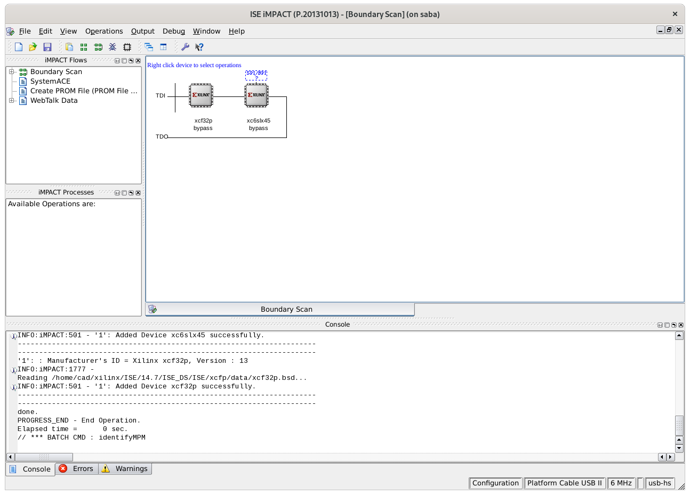

## Create MCS file

### For Spartan-6

1. Double click on "Create PROM File" in the left side of the window

2. On the left side of the window, choose "Xilinx Flash/PROM" and click → for the next step.

3. On the middle of the window, choose "Platform Flash" as PROM Family, "xcf32p" as PROM Device, and then click "Add Storage device".
After that, click → for the next step.

4. On the right side of the window, choose "SPI PROM" as Storage device, "128Mbit" as Storage device size, and then click OK.

5. Set the output file name as you like and output file location. Click OK.

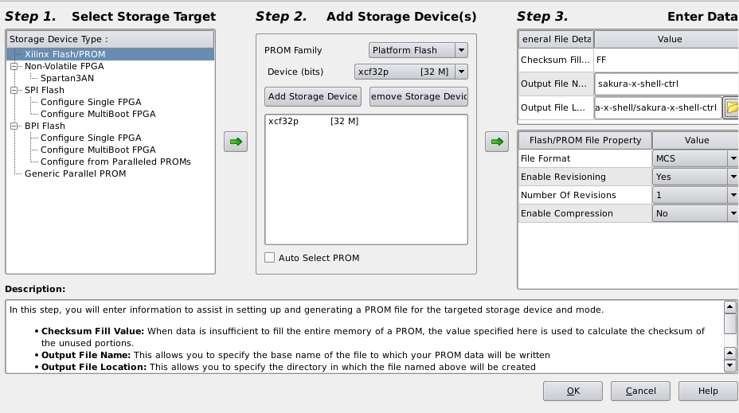

6. Click OK on the following dialog.

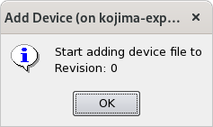

7. Select bit file for the MCS file and click OK.

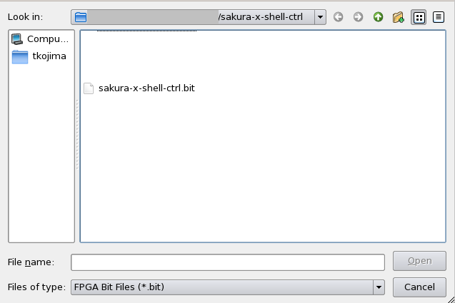

8. Click No on the following dialog.

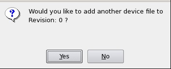

9. Click OK on the following dialog.

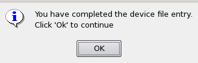

10. Lastly, double click on "Generate File" in the left side of the window.

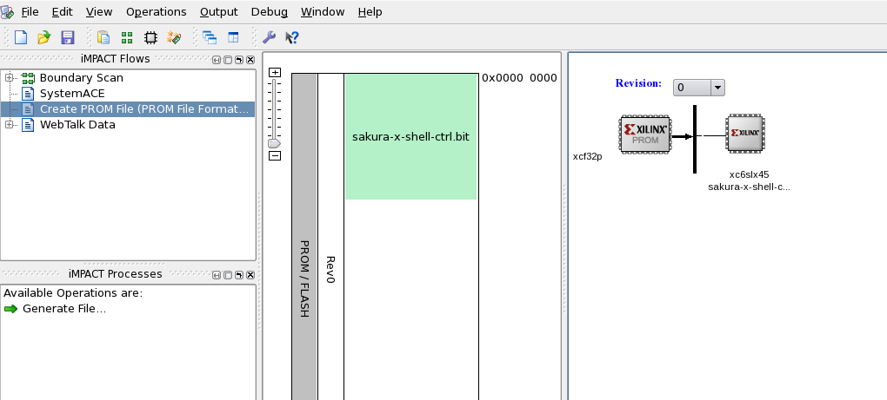

### For Kintex-7

See [this page](./config_mcs_vivado.md) to use Vivado to create MCS file for Kintex-7.

Almost the same as the Spartan-6 configuration but PROM File Formatter is configured as below.

* Storage Device Type: BPI Flash -> Configure Single FPGA
* Target FPGA: Kintex-7
* Storage Device: 128M
* Flash/PROM File Property:
  * Data Width: x16

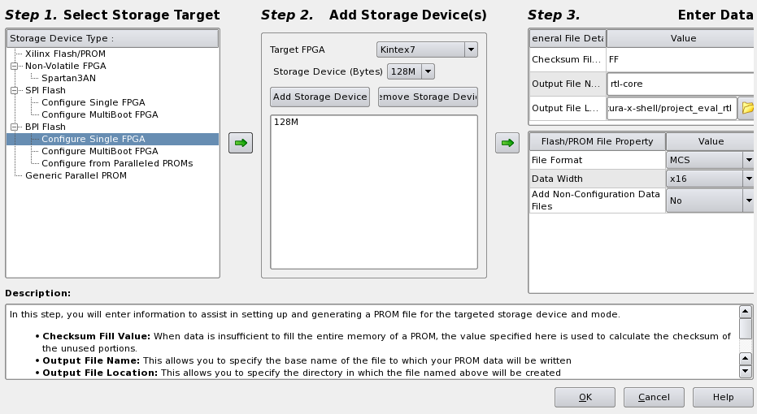


## Program the Flash memory 

### For Spartan-6

1. Right click on xcf32p and "Assign New Configuration File..."

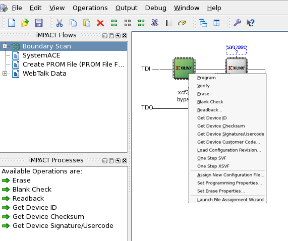

2. Select the generated mcs file and click OK.

3. Select xcf32p as Part name and click OK.

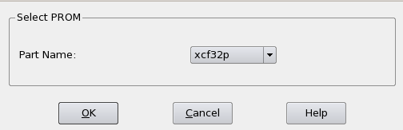

4. Selecting the xcf32p device, click "Program" on the left side of the window.

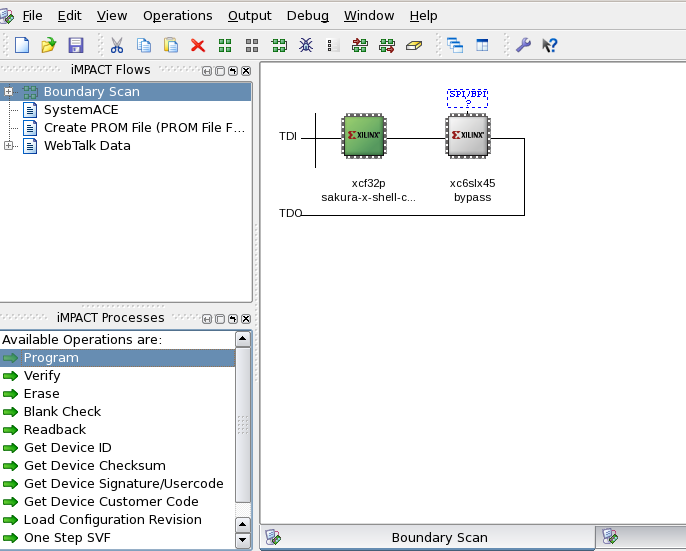

### For Kintex-7

1. double click "SPI/BPI?" on the boundary scan window.

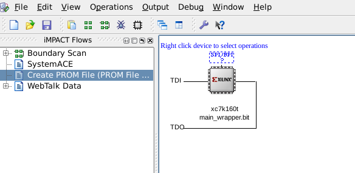

2. select the generated mcs file and click OK.

3. select "BPI PROM" and "28F128P30" as PROM device and select 16 as Data Width, then click OK.

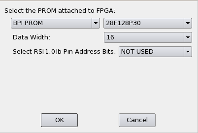

4. Selecting the added Flash memory, click "Program" on the left side of the window.

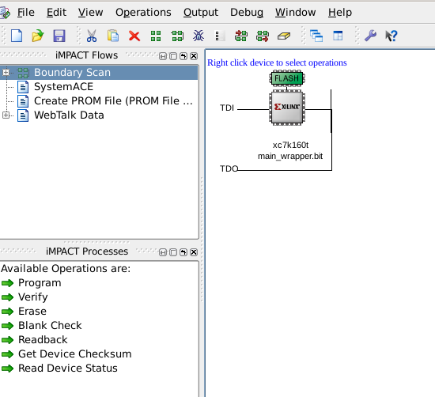
