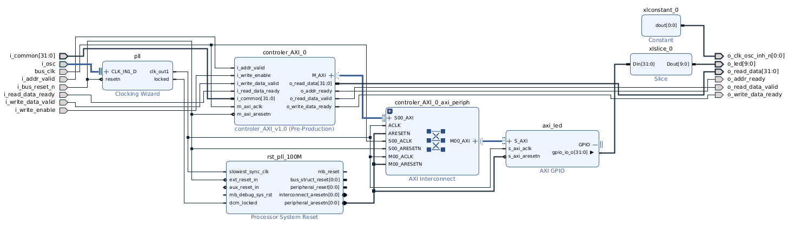

## Create template project

This repository provides a tcl script to create a Vivado project with SAKURA-X shell.
As an option, the script can enable Memory Interface Generator (MIG) IP in the generated block design to use DDR memory (128MB DDR3-800 SDRAM, compatible with Micron MT41J64M16JT).

1. Clone this repository

2. Run the following command to launch Vivado and create a project.

```bash
vivado -source vivado/init-shell-project.tcl
```

The following options are available for tclargs
* --project-dir <path>: Specify the project directory (default: ./proj_shell)
* --project-name <name>: Specify the project name (default: proj_shell)
* --with-mig: Enable MIG IP in generated block design (default: disabled)

## Generated block design

The template block design includes the following components:
* Controller AXI: which convert access signals from Spartan-6 to AXI4 signals
  * 100MHz clock is used for AXI4 signals
* Clocking Wizard: which generates 100MHz clock for 200MHz differential clock from external oscillator
* AXI GPIO: which provides GPIO interface to control LEDs on SAKURA-X



